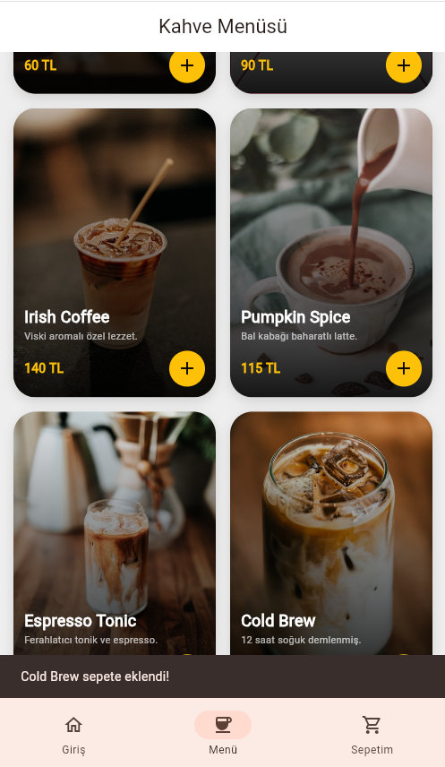
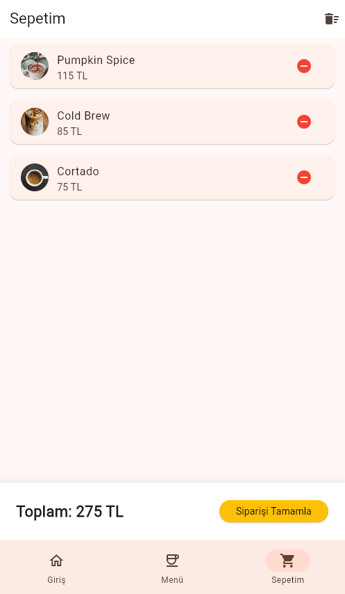

# ☕ Coffee Master - Modern Katalog Uygulaması

[](https://flutter.dev)
[](https://dart.dev)

Coffee Master, kahve tutkunları için tasarlanmış, modern arayüzlü ve kullanıcı dostu bir katalog uygulamasıdır. 

## 🚀 Proje Hakkında
Bu uygulama, bir kahve dükkanının dijital menüsünü simüle eder. Kullanıcılar kahve çeşitlerini inceleyebilir, içeriklerini görebilir ve beğendikleri ürünleri sepetlerine ekleyerek toplam tutarı takip edebilirler.

### Öne Çıkan Özellikler:
- **Modern UI/UX:** Material 3 bileşenleri ve şık gradyan tasarımları.
- **Provider State Management:** Sepet işlemlerinin uygulama genelinde anlık senkronizasyonu.
- **Dinamik Katalog:** kahve türü ve yüksek kaliteli görsel sunumu.
---

## 📸 Ekran Görüntüleri

| Ana Sayfa | Kahve Menüsü | Sepetim |
|-----------|--------------|---------|
|  |  |  |

---

## 🛠 Teknik Detaylar

- **Flutter Sürümü:** 3.x (En güncel stabil sürüm)
- **Paketler:** - `provider`: Durum yönetimi için.

---

## ⚙️ Kurulum ve Çalıştırma Adımları

Bu projeyi yerel bilgisayarınızda veya Chrome üzerinde çalıştırmak için aşağıdaki adımları izleyin:

### 1. Ön Hazırlık

Bilgisayarınızda **Flutter SDK**'nın kurulu olduğundan ve `flutter doctor` komutunun sorunsuz çalıştığından emin olun.

### 2. Projeyi İndirin  

Depoyu klonlayın veya ZIP olarak indirin ve choreme üzerinden çalıştırabilirsiniz:

```bash
git clone https://github.com/[KULLANICI_ADIN]/[REPO_ADIN].git
cd [REPO_ADIN]

flutter pub get

flutter run -d chrome
